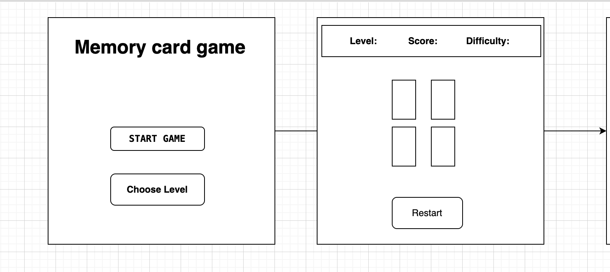

# MemoryCardGame

## About the Game

This is a simple memory card game where players try to find pairs of matching cards. The game has three difficulty levels: Easy, Medium, and Hard. Each level has more cards and more time to complete. The goal is to match all the pairs before the timer runs out.

I chose this project to practice JavaScript and learn how to create interactive games in the browser.

## How to Play

Choose a difficulty level (Easy, Medium, or Hard).

Click the "Start Game" button to begin.

Click on cards to flip them and try to find matching pairs.

If two flipped cards match, they stay face up and you earn points.

If they don’t match, they flip back after one second.

Match all pairs before the time runs out to complete the level.

Complete all three levels to finish the game.

Use the restart button to restart the current level at any time.

**Getting Started**

To play the game, open the index.html file in your web browser. No installation or build steps are needed.

https://danial95-prog.github.io/MemoryGame/

# Screenshot
  

  

  

  

# Wireframe
 

 

# Technologies Used

HTML

CSS

JavaScript

## Next Steps

In the future, I want to add:

Sound effects for card flips and matches

A scoreboard to save best scores and times

More levels or game modes

Mobile-friendly design

# Attributes
 Ga notes

 https://www.w3schools.com/js/js_random.asp

 https://www.w3schools.com/js/js_array_sort.asp

 https://www.codecademy.com/resources/docs/javascript/dom-manipulation/innerHTML